<div align="center">
<h1>OneScan</h1>
<p>OneScan 是一款用于递归目录扫描的 BurpSuite 插件，为发现更深层次目录下隐藏的漏洞赋能</p>
<div align="center">

[](https://github.com/vaycore/OneScan/stargazers)
[](https://github.com/vaycore/OneScan/releases)
[](https://github.com/vaycore/OneScan/tags)
[](https://github.com/vaycore/OneScan/releases)

</div>
</div>

## 插件介绍

OneScan 插件的思路由 One 哥提供，我负责将 One 哥的思路进行编码变现。插件起初是为了发现站点深层目录下的 `Swagger-API` 接口文档，后面随着功能的完善和使用姿势的增加，目前可以完成：发现隐藏接口、发现敏感信息泄漏、测试未授权、越权接口等测试工作

> 参与开发人员：
>
> - 主要开发: vaycore
> - 后续更新功能: Rural.Dog
> - 产品经理: 0ne_1

### 简单示例

例如配置 Payload 字典如下：

```text
/api-docs
/{{domain.name}}.zip
```

目标站点访问：`https://www.xxxxxx.com/a/b/c/xxx.min.js` ，插件会自动扫描如下的路径：

```text
https://www.xxxxxx.com/api-docs
https://www.xxxxxx.com/xxxxxx.zip
https://www.xxxxxx.com/a/api-docs
https://www.xxxxxx.com/a/xxxxxx.zip
https://www.xxxxxx.com/a/b/api-docs
https://www.xxxxxx.com/a/b/xxxxxx.zip
https://www.xxxxxx.com/a/b/c/api-docs
https://www.xxxxxx.com/a/b/c/xxxxxx.zip
```

## 插件安装

BurpSuite 安装流程如下（不同版本可能有所差异）：

```text
Extender -> Extensions -> Add -> Select File -> Next
Extensions -> Installed -> Add -> Select File -> Next
```

流程结束后，打印如下信息表示插件安装完成：

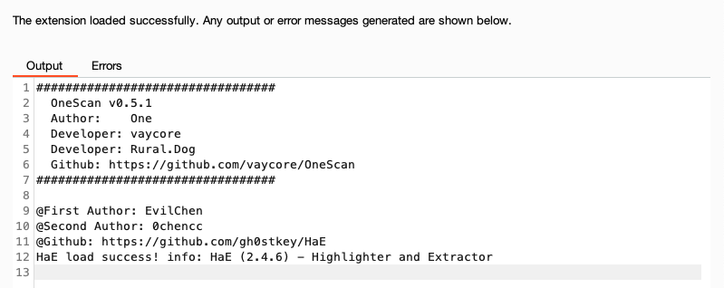

插件配置文件默认存放路径如下（优先检测当前插件 JAR 包所在目录下是否存在 `OneScan` 目录，如果存在，将使用该目录作为工作目录；否则，使用如下路径作为工作目录）：

```text
linux、macOS：
~/.config/OneScan/

windows：
C:\Users\<用户名>\.config\OneScan\
```

## 插件说明

### 主动扫描

可以从 BurpSuite 其它位置发送到 OneScan 主动扫描

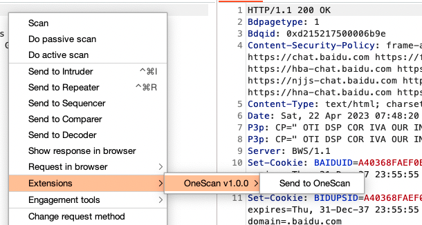

可以使用已配置的字典发送到 OneScan 主动扫描（存在1个以上的字典配置才会显示该菜单）：

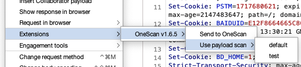

### 辅助面板

提取请求和响应包中 **JSON** 格式的字段，插件 `1.0.0` 版本新增 `Fingerprint` 指纹信息展示

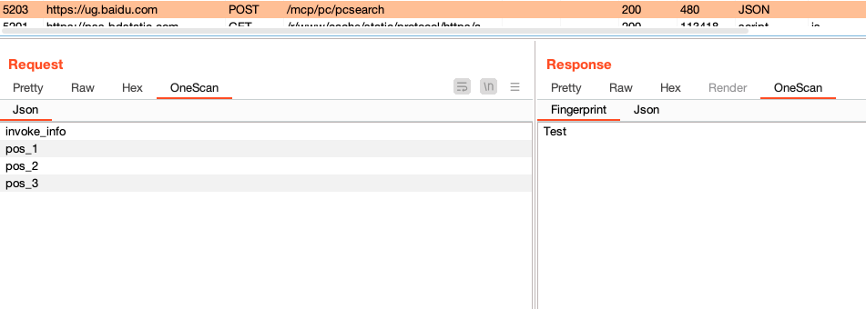

### 动态变量

目前支持的动态变量如下（以目标：`http://api.admin.xxxxxx.com:81/path/to/index.html` 为例，日期和时间以：`2030-08-09 07:08:09` 为例）：

```text
{{protocol}} - 请求头中的协议（格式：http）
{{host}} - 请求头中的Host（格式：api.admin.xxxxxx.com:81）
{{webroot}} - 一级目录动态变量（格式：path；不存在一级目录时，忽略当前Payload）
{{ip}} - 当前 {{domain}} 解析的IP地址（如果domain是IP地址，直接返回；解析失败时，忽略当前Payload）

域名相关：
{{domain}} - 请求头中不包含端口号的Host（格式：api.admin.xxxxxx.com）
{{domain.main}} - 主域名（格式：xxxxxx.com；如果是IP地址或格式无效，忽略当前Payload）
{{domain.name}} - 主域名的名称（格式：xxxxxx；如果是IP地址或格式无效，忽略当前Payload）

子域名相关：
{{subdomain}} - 子域名（格式：api；只有主域名时，忽略当前Payload）
{{subdomains}} - 完整子域名（格式：api.admin；只有主域名时，忽略当前Payload）
{{subdomains.%d}} - 完整子域名分段取值，其中 %d 表示数字类型（取值的下标），使用示例如下：
    {{subdomains.0}}：取第一个子域名（格式：api；只有主域名时，忽略当前Payload）
    {{subdomains.1}}：取第二个子域名（格式：admin；只有主域名或取值失败时，忽略当前Payload）

随机值相关：
{{random.ip}} - 随机IPv4值
{{random.local-ip}} - 随机内网IPv4值
{{random.ua}} - 随机UserAgent值，随机源可配置

日期相关：
{{date.yyyy}} - 日期：年（格式：2030）
{{date.MM}} - 日期：月（格式：08）
{{date.dd}} - 日期：日（格式：09）
{{date.yy}} - 日期：年（格式：30）
{{date.M}} - 日期：月（格式：8）
{{date.d}} - 日期：日（格式：9）

时间相关：
{{timestamp}} - Unix时间戳（单位：秒）
{{time.HH}} - 时间：小时（格式：07）
{{time.mm}} - 时间：分钟（格式：08）
{{time.ss}} - 时间：秒（格式：09）
{{time.H}} - 时间：小时（格式：7）
{{time.m}} - 时间：分钟（格式：8）
{{time.s}} - 时间：秒（格式：9）
```

### Databoard数据看板

插件数据看板说明如下

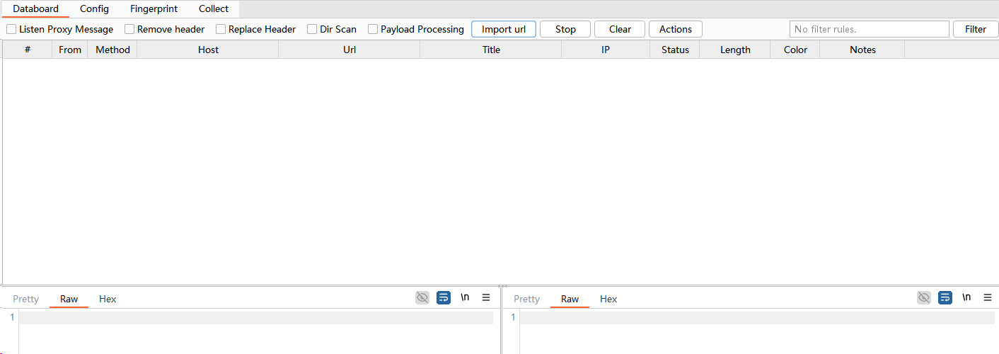

- `Listen Proxy Message` 开关被动扫描（默认禁用），代理的请求包都会经过 OneScan 插件（建议配置白名单后启用）
- `Remove Header` 开关移除请求头（默认禁用），根据 `Request -> Remove header` 里的配置，移除请求头中对应的值
- `Replace Header` 开关请求头替换（默认启用），使用 `Request -> Header` 中配置的请求头请求数据
- `DirScan` 开关递归扫描（默认启用），对目标进行递归扫描
- `Payload Processing` 开关请求包处理功能（默认启用）
- `Filter` 设置数据过滤规则
- `Import url` 导入 URL 目标扫描
- `Stop` 停止正在扫描的任务
- `Actions` 操作菜单（列表鼠标右键菜单的所有功能）

#### 过滤规则配置

点击主面板的 `Filter` 按钮，打开设置过滤规则对话框（插件 `0.5.2` 版本新增功能）

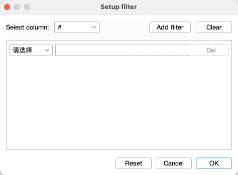

- `Select column` 选择要过滤的列
- `Add filter` 为选中列添加过滤条件
- `Clear` 清除选中列的所有过滤规则
- `Reset` 重置所有过滤规则
- `Cancel` 取消本次的所有变更
- `OK` 使配置的规则生效

#### 临时过滤规则

通过右键菜单，点击 `Temporarily filter selected data` 添加临时过滤规则：

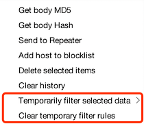

只支持临时添加相同值的过滤（复杂的规则，请点击 `Filter` 按钮处理），例如选中了 `Status` 是 `400` 和 `503` 的两条数据，生成的临时过滤规则示例如下：

```text
Status != 400 && Status != 503
```

### Config配置

#### Payload（字典、请求包处理）

Payload 配置界面如下

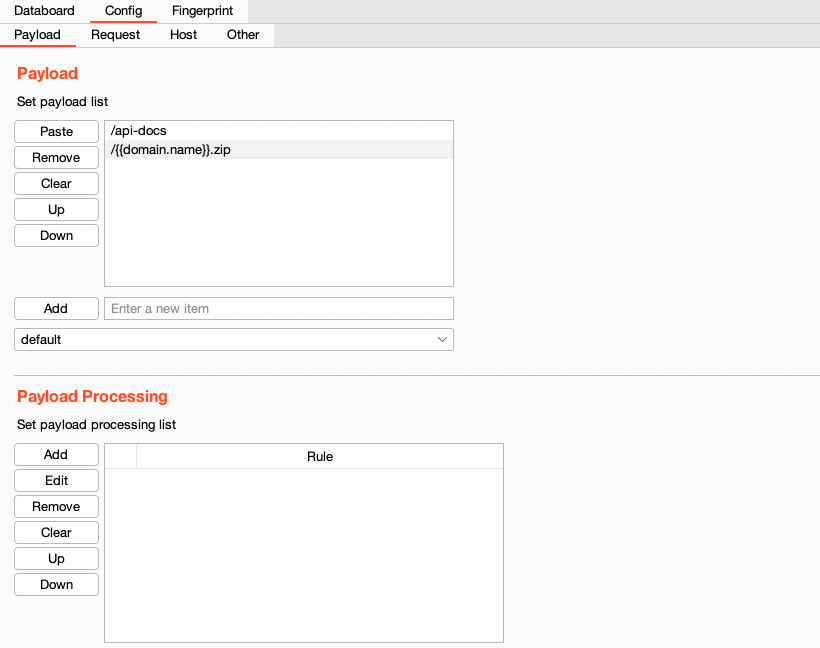

- `Payload` 配置递归扫描的字典
- `Payload Processing` 配置请求过程中对数据包的处理（例如：URL 添加前缀、后缀，Body 正则匹配和替换）

#### Request（请求相关配置）

Request 配置界面如下

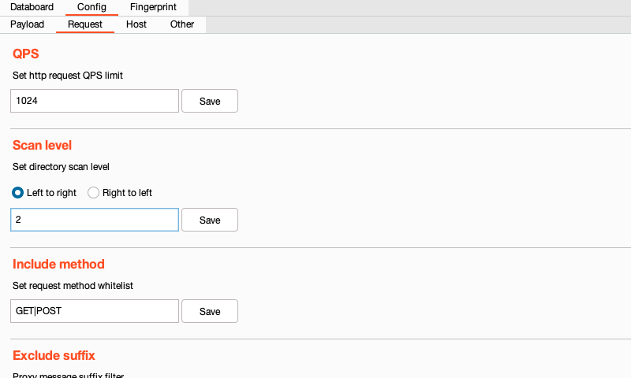

- `QPS` QPS 限制，限制每秒请求的数量，范围（`1-9999`）
- `Request delay` 请求延时限制，限制每次请求的间隔时间，范围（`0-99999`）。（单位：毫秒）
- `Scan level` 限制目录扫描层级，范围（`1-99`）。限制方向：`Left to right`（从左往右），`Right to left`（从右往左）
- `Retry` 请求失败时重试次数配置，范围（`0-9`）
- `Include method` 配置请求方法白名单
- `Exclude suffix` 排除指定后缀的数据包
- `Header` 设置扫描的请求头（启用替换请求头时生效）
- `Remove header` 设置移除的请求头字段，根据请求头字段移除对应的请求头（启用移除请求头开关时生效）
- `UserAgent` 这里配置的是 `{{random.ua}}` 变量列表里的值

#### Host（主要是黑、白名单配置）

Host配置界面如下

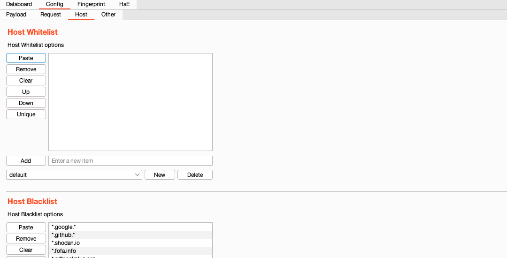

- `Allowlist` 配置白名单列表，如果该列表不为空，插件只对匹配的 Host 进行请求
- `Blocklist` 配置黑名单列表，如果该列表不为空，插件不会向匹配的 Host 发起请求

#### Other（其它配置）

Other配置界面如下

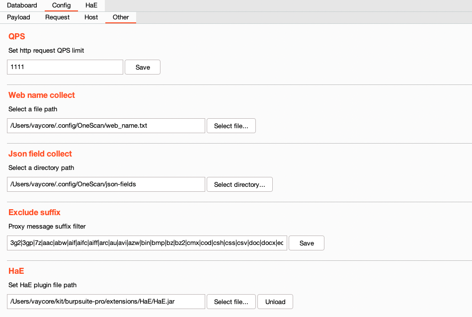

- `Maximum display length` 限制请求、响应包的最大显示长度（插件 `1.6.11` 版本新增）
- `Collect directory` 数据收集存放目录
- `Wordlist Directory` 插件`1.0.0`版本新增字典管理，此目录下包含所有字典文件的配置

### Fingerprint指纹

插件 `1.0.0` 版本新增 `Fingerprint` 指纹模块（版本 `2.0.0` 已重构指纹模块，匹配能力更加强大），指纹管理界面如下

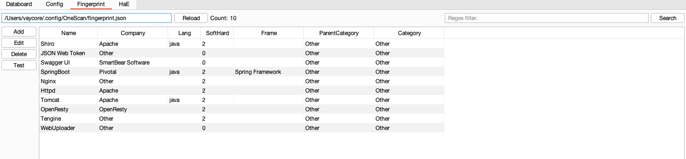

- `Reload` 重新加载配置文件中的指纹信息
- `Search` 搜索指纹库中的指纹信息
- `Add` 添加指纹信息
- `Edit` 编辑选中的指纹信息
- `Delete` 删除选中的指纹信息
- `Test` 测试指纹规则
- `Clear cache` 清除指纹识别缓存
- `Column manager` 指纹字段管理

指纹信息全程使用 UI 添加，不需要编写正则匹配规则（也可以使用正则匹配），UI 界面如下：

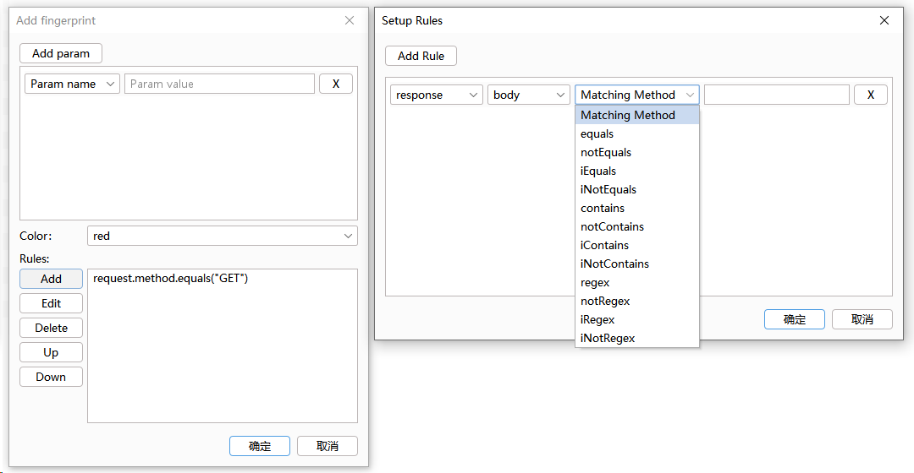

#### 指纹信息说明

- `Add param` 添加指纹参数
- `Param Name` 指纹参数名（与指纹字段绑定）
- `Param Value` 指纹参数值
- `Color` 命中指纹规则后标记的颜色（参考了 [HaE](https://github.com/gh0stkey/HaE) 项目的颜色标记机制）
- `Rules` 指纹匹配规则

#### 指纹规则说明

包含 HTTP 通用字段如下：

- `firstLine` HTTP 首行（格式示例：`GET / HTTP/1.1` 、 `HTTP/1.1 200 OK`）
- `header` HTTP 协议头
- `body` HTTP Body 数据
- `bodyMd5` HTTP Body 数据 MD5 值
- `bodyHash` HTTP Body 数据 Hash 值
- `bodyHex` HTTP Body 数据 Hex 值（格式示例：000102030405；只取前 100 个字节）
- `data` 整个 HTTP 数据包

其中 HTTP 请求数据源包含如下字段：

- `method` HTTP 请求方法
- `url` HTTP 请求 URL（示例格式：/path/to/index.do?a=1）

其中 HTTP 响应数据源包含如下字段：

- `status` HTTP 响应状态码
- `server` HTTP 响应头中 Server 的值
- `title` HTML 标题

共十二种匹配方法

- `equals` 匹配相等
- `notEquals` 匹配不相等
- `iEquals` 匹配相等（忽略大小写）
- `iNotEquals` 匹配不相等（忽略大小写）
- `contains` 包含
- `notContains` 不包含
- `iContains` 包含（忽略大小写）
- `iNotContains` 不包含（忽略大小写）
- `regex` 正则匹配
- `notRegex` 正则不匹配
- `iRegex` 正则匹配（忽略大小写）
- `iNotRegex` 正则不匹配（忽略大小写）

### Collect数据收集

插件 `1.5.0` 版本新增 `Collect` 数据收集面板，面板截图如下：

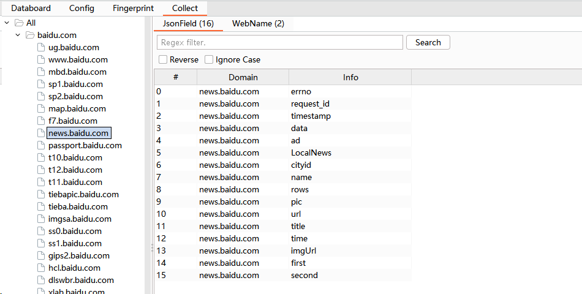

- `All` 列出所有收集的数据
- `JsonField` 收集的 JSON 字段信息
- `WebName` 收集的 WebName 信息（例如访问：`/api/v1/users`，会自动收集 `api`）
- `Search` 在列表中搜索对应数据（正则表达式）
- `Reverse` 反向搜索（勾选后，例如搜索：`a`，列表中不会出现包含 `a` 的数据）
- `Ignore Case` 忽略大小写

## 插件演示

将如下数据包主动发送到 OneScan 插件扫描：

```text
POST /mcp/pc/pcsearch HTTP/1.1
Host: ug.baidu.com
Content-Length: 56
User-Agent: Mozilla/5.0 (Windows NT 10.0; Win64; x64) AppleWebKit/537.36 (KHTML, like Gecko) Chrome/108.0.0.0 Safari/537.36
Content-Type: application/json
Accept: */*
Origin: https://www.baidu.com
Accept-Encoding: gzip, deflate
Accept-Language: zh-CN,zh;q=0.9
Connection: close

{"invoke_info":{"pos_1":[{}],"pos_2":[{}],"pos_3":[{}]}}
```

面板展示如下：

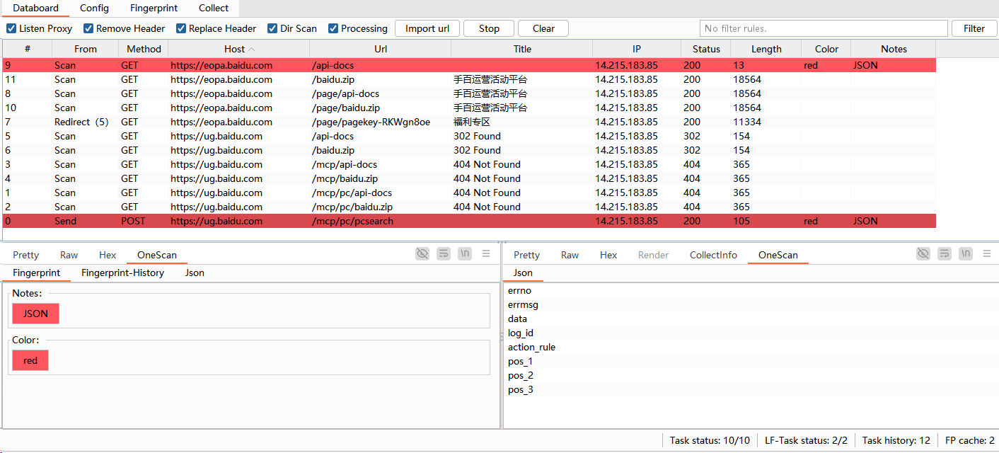

## QQ交流群

欢迎各位师傅加入 OneScan 交流群


## 项目热度

非常感谢各位师傅的关注和支持（如果觉得项目还不错，请给项目一个 `Star` 吧）

<a href="https://star-history.com/#vaycore/OneScan&Date">
 <picture>
   <source media="(prefers-color-scheme: dark)" srcset="https://api.star-history.com/svg?repos=vaycore/OneScan&type=Date&theme=dark" />
   <source media="(prefers-color-scheme: light)" srcset="https://api.star-history.com/svg?repos=vaycore/OneScan&type=Date" />
   
 </picture>
</a>

## END

- 代码写的很乱，还请师傅们见谅
- 欢迎各位师傅提交 `Issues` 和 `Pull requests`，一起完善项目
