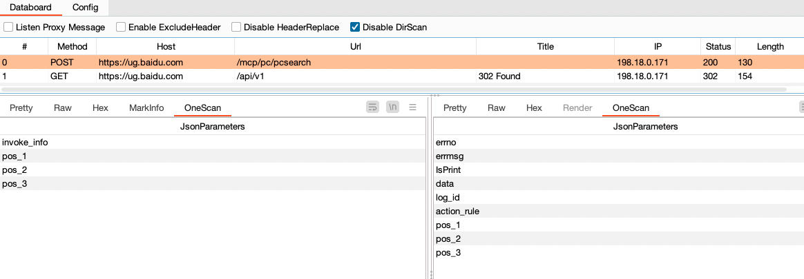

# OneScan

OneScan是一个递归目录扫描的BurpSuite插件。

## 插件介绍

OneScan插件的思路由One哥提供，我负责将One哥的思路进行编码变现。插件起初是为了发现站点的 `Swagger-API` 文档页面，例如有些站点将 `Swagger-API`
文档存放在当前接口同路径下（或者更深层次目录）。OneScan插件的出现可以快速发现这类页面和接口，只需要配置对应的字典即可。

> 参与开发人员：
>
> - 主要开发: vaycore
> - 后续更新功能: Rural.Dog
> - 产品经理: 0ne_1

## 插件安装

BurpSuite 安装流程如下：

```text
Extender -> Extensions -> Add -> Select File -> Next
```

流程结束后，打印如下信息表示插件安装完成（需要配置 [HaE](https://github.com/gh0stkey/HaE) 插件之后才会显示 **HaE** 插件的日志信息）：


插件配置文件存放路径如下：

```text
linux、macOS：
~/.config/OneScan/

windows：
C:\Users\<用户名>\.config\OneScan\
```

## 插件使用

> 使用前需要先配置一下黑白名单列表（否则只允许 `127.0.0.1` 地址扫描）


### 主面板

插件主面板如下


- `Listen Proxy Message` 开关被动扫描，代理的请求包都会经过OneScan（建议配置完白名单再启用）
- `Enable ExcludeHeader` 开关排除请求头，启用时，根据 `Request -> Exclude header` 里的配置，排除请求头中对应的值
- `Disable HeaderReplace` 开关请求头替换，启用时，不使用 `Request -> Header` 中配置的请求头请求数据
- `Disable DirScan` 开关递归扫描，启用时，不对目标进行递归扫描
- `Filter` 设置数据过滤规则

### 过滤规则配置

点击主面板的`Filter`按钮，打开设置过滤规则对话框（插件`0.5.2`版本新增功能）


- `Select column` 选择要过滤的列
- `Add filter` 为选中列添加过滤条件
- `Clear` 清除选中列的所有过滤规则
- `Reset` 重置所有过滤规则
- `Cancel` 取消本次的所有变更
- `OK` 使配置的规则生效

### 主动扫描

可以从BurpSuite其它位置发送到OneScan主动扫描


> 注意：白名单同样对主动扫描生效

### 辅助面板

提取请求和响应包中**JSON**格式的字段



### 动态变量

目前支持的动态变量如下：

```text
{{host}} - 原请求头中的Host
{{domain}} - 原请求头中的Host（不包含端口号）
{{domain.main}} - 主域名（如：`www.google.com` => `google.com`；注意：如果domain是IP地址，那么该值也是IP地址）
{{domain.name}} - 主域名的名称（如：`www.google.com` => `google`；注意：如果domain是IP地址，那么该值也是IP地址）
{{protocol}} - 原请求头中的协议（http、https）
{{timestamp}} - Unix时间戳（单位：秒）
{{random.ip}} - 随机IPv4值
{{random.ua}} - 随机UserAgent值，随机源可配置
```

### Payload

Payload配置界面如下


- `Payload` 配置递归扫描的字典
- `Payload Processing` 配置请求过程中对数据包的处理（例如：URL添加前缀、后缀，Body正则匹配和替换）

### Request

Request配置界面如下


- `QPS` QPS限制，限制每秒请求的数量，最大值 `9999`
- `Include method` 配置请求方法白名单
- `Exclude suffix` 排除指定后缀的数据包
- `Header` 递归扫描过程的请求头配置，可配置变量
- `Exclude header` 请求时排除请求头中对应的值
- `UserAgent` 这里配置的是 `{{random.ua}}` 变量列表里的值

### Host

Host配置界面如下


- `Host Whitelist` 配置白名单列表，如果该列表不为空，插件则只能请求该列表中的Host
- `Host Blacklist` 配置黑名单列表，插件不对该列表配置的Host进行请求

### Other

Other配置界面如下


- `Web name collect` Web目录名收集（例如：`http://xxx.com/wapi/xxx.html` 会将该 url 中的 `wapi` 写入到指定的文件中）
- `Json field collect` Json字段收集（收集json格式响应包中的所有key值，保存到指定目录）
- `HaE` 配置与 [HaE](https://github.com/gh0stkey/HaE) 插件联动，实现主面板数据高亮

## 插件演示

浏览器访问某搜索网站，面板展示如下


## END

- 代码写的很乱，还请师傅们见谅
- 欢迎各位师傅提交 `Issue` 和 `Pull requests`，一起完善项目
