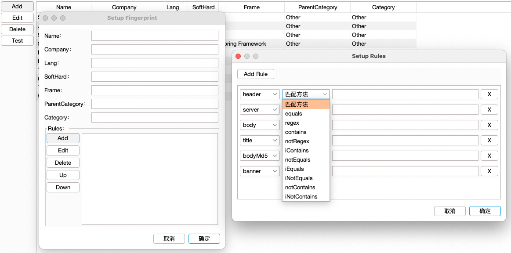

# OneScan

OneScan是递归目录扫描的BurpSuite插件。

## 插件介绍

OneScan插件的思路由One哥提供，我负责将One哥的思路进行编码变现。插件起初是为了发现站点的 `Swagger-API` 文档页面，例如有些站点将 `Swagger-API`
文档存放在当前API接口同路由下（或者更深层次目录），使用OneScan插件可以快速发现这类页面和接口

> 参与开发人员：
>
> - 主要开发: vaycore
> - 后续更新功能: Rural.Dog
> - 产品经理: 0ne_1

### 简单示例

例如配置Payload字典如下：

```text
/api-docs
/{{domain.name}}.zip
```

目标站点访问：`https://www.xxxxxx.com/a/b/c/xxx.min.js` ，插件会自动扫描如下的路径：

```text
https://www.xxxxxx.com/api-docs
https://www.xxxxxx.com/xxxxxx.zip
https://www.xxxxxx.com/a/api-docs
https://www.xxxxxx.com/a/xxxxxx.zip
https://www.xxxxxx.com/a/b/api-docs
https://www.xxxxxx.com/a/b/xxxxxx.zip
https://www.xxxxxx.com/a/b/c/api-docs
https://www.xxxxxx.com/a/b/c/xxxxxx.zip
```

## 插件安装

BurpSuite 安装流程如下：

```text
Extender -> Extensions -> Add -> Select File -> Next
```

流程结束后，打印如下信息表示插件安装完成（需要在 Config -> Other -> HaE 中配置 [HaE](https://github.com/gh0stkey/HaE) 插件 JAR 包路径后，才会显示 **HaE** 插件的日志信息、数据高亮功能）：


插件配置文件默认存放路径如下（优先检测当前插件 jar 包所在目录下是否存在 `OneScan` 目录，如果存在，将使用该目录作为工作目录；否则，使用如下路径作为工作目录）：

```text
linux、macOS：
~/.config/OneScan/

windows：
C:\Users\<用户名>\.config\OneScan\
```

## 插件说明

### 主动扫描

可以从BurpSuite其它位置发送到OneScan主动扫描


可以使用已配置的字典发送到OneScan主动扫描（存在1个以上的字典配置才会出现该菜单）：


### 辅助面板

提取请求和响应包中**JSON**格式的字段，插件`1.0.0`版本新增`Fingerprint`指纹信息展示


### 动态变量

目前支持的动态变量如下（以目标：`http://www.xxxxxx.com:81/path/to/index.html` 为例）：

```text
{{host}} - 请求头中的Host（格式：www.xxxxxx.com:81）
{{domain}} - 请求头中不包含端口号的Host（格式：www.xxxxxx.com）
{{domain.main}} - 主域名（格式：xxxxxx.com；如果是IP地址或无效格式，会自动跳过这条Payload）
{{domain.name}} - 主域名的名称（格式：xxxxxx；如果是IP地址或无效格式，会自动跳过这条Payload）
{{protocol}} - 请求头中的协议（格式：http）
{{timestamp}} - Unix时间戳（单位：秒）
{{random.ip}} - 随机IPv4值
{{random.local-ip}} - 随机内网IPv4值
{{random.ua}} - 随机UserAgent值，随机源可配置
{{subdomain}} - 子域名动态变量（格式：www；只有主域名时：`xxxxxx.com` => `xxxxxx`）
{{webroot}} - 一级目录动态变量（格式：path；不存在一级目录时，会自动跳过这条Payload）
```

### Databoard数据看板

插件数据看板说明如下


- `Listen Proxy Message` 开关被动扫描（默认禁用），代理的请求包都会经过OneScan（建议配置白名单后启用）
- `Exclude Header` 开关排除请求头（默认禁用），根据 `Request -> Exclude header` 里的配置，排除请求头中对应的值
- `Replace Header` 开关请求头替换（默认启用），使用 `Request -> Header` 中配置的请求头请求数据
- `DirScan` 开关递归扫描（默认启用），对目标进行递归扫描
- `Payload Processing` 开关 Payload Processing 功能（默认启用）
- `Filter` 设置数据过滤规则
- `Import url` 导入 Url 目标进行扫描
- `Stop` 停止正在扫描的任务

#### 过滤规则配置

点击主面板的`Filter`按钮，打开设置过滤规则对话框（插件`0.5.2`版本新增功能）


- `Select column` 选择要过滤的列
- `Add filter` 为选中列添加过滤条件
- `Clear` 清除选中列的所有过滤规则
- `Reset` 重置所有过滤规则
- `Cancel` 取消本次的所有变更
- `OK` 使配置的规则生效

### Config配置

#### Payload（字典、Payload处理）

Payload配置界面如下


- `Payload` 配置递归扫描的字典
- `Payload Processing` 配置请求过程中对数据包的处理（例如：URL添加前缀、后缀，Body正则匹配和替换）

#### Request（请求相关配置）

Request配置界面如下


- `QPS` QPS限制，限制每秒请求的数量，范围（`1-9999`）
- `Request delay` 请求延时限制，限制每次请求的间隔时间，范围（`0-99999`）。（单位：毫秒）
- `Scan level` 限制目录扫描层级，范围（`1-99`）。限制方向：`Left to right`（从左往右），`Right to left`（从右往左）
- `Retry` 请求失败时重试次数配置，范围（`0-9`）
- `Include method` 配置请求方法白名单
- `Exclude suffix` 排除指定后缀的数据包
- `Header` 递归扫描过程的请求头配置，可配置变量
- `Exclude header` 请求时排除请求头中对应的值
- `UserAgent` 这里配置的是 `{{random.ua}}` 变量列表里的值

#### Host（主要是黑、白名单配置）

Host配置界面如下


- `Host Whitelist` 配置白名单列表，如果该列表不为空，插件则只能请求该列表中的Host
- `Host Blacklist` 配置黑名单列表，插件不对该列表配置的Host进行请求

#### Other（其它配置）

Other配置界面如下


- `Collect directory` 数据收集存放目录
- `Wordlist Directory` 插件`1.0.0`版本新增字典管理，此目录下包含所有字典文件的配置
- `HaE` 配置与 [HaE](https://github.com/gh0stkey/HaE) 插件联动，实现主面板数据高亮（配置路径示例如图）
- `Clear Temp` 清除指纹识别缓存（用于加快指纹识别的速度）

### Fingerprint指纹

插件`1.0.0`版本新增`Fingerprint`指纹模块，指纹管理界面如下


- `Reload` 重新加载配置文件中的指纹信息
- `Search` 搜索指纹库中的指纹信息
- `Add` 添加指纹信息
- `Edit` 编辑选中的指纹信息
- `Delete` 删除选中的指纹信息
- `Test` 测试指纹规则

指纹信息全程使用UI添加，不需要编写正则匹配规则（也可以使用正则匹配），UI界面如下：



#### 指纹信息说明

- `Name` 指纹名称（产品名）
- `Company` 产品公司（默认：Other）
- `Lang` 编程语言
- `SoftHard` 软硬件（0=其它；1=硬件；2=软件）
- `Frame` 产品使用的开发框架
- `ParentCategory` 父类别（默认：Other）
- `Category` 类别（默认：Other）
- `Rules` 指纹匹配规则

#### 指纹规则说明

包含七种数据源

- `header` Header
- `server` Header 中的 Server 值
- `body` Body 数据
- `title` Html 标题
- `bodyMd5` Body 数据 MD5 值
- `bodyHash` Body 数据 Hash 值
- `banner` 其它协议的 Banner 信息（HTTP协议无法匹配该值）

共有十种匹配方法

- `equals` 匹配相等
- `notEquals` 匹配不相等
- `iEquals` 匹配相等（忽略大小写）
- `iNotEquals` 匹配不相等（忽略大小写）
- `contains` 包含
- `notContains` 不包含
- `iContains` 包含（忽略大小写）
- `iNotContains` 不包含（忽略大小写）
- `regex` 正则匹配
- `notRegex` 正则不匹配

### Collect数据收集

插件 `1.5.0` 版本新增 `Collect` 数据收集面板，面板截图如下：


- `All` 列出所有收集的数据
- `JsonField` 收集的 JSON 字段信息
- `WebName` 收集的 WebName 信息（例如访问：`/api/v1/users`，会自动收集 `api`）
- `Search` 在列表中搜索对应数据（正则表达式）
- `Reverse` 反向搜索（勾选后，例如搜索：`a`，列表中不会出现包含 `a` 的数据）
- `Ignore Case` 忽略大小写

## 插件演示

将如下数据包主动发送到OneScan：

```text
POST /mcp/pc/pcsearch HTTP/1.1
Host: ug.baidu.com
Content-Length: 56
User-Agent: Mozilla/5.0 (Windows NT 10.0; Win64; x64) AppleWebKit/537.36 (KHTML, like Gecko) Chrome/108.0.0.0 Safari/537.36
Content-Type: application/json
Accept: */*
Origin: https://www.baidu.com
Accept-Encoding: gzip, deflate
Accept-Language: zh-CN,zh;q=0.9
Connection: close

{"invoke_info":{"pos_1":[{}],"pos_2":[{}],"pos_3":[{}]}}
```

面板展示如下：


## QQ交流群

欢迎各位师傅加入 OneScan 交流群


## 项目热度

非常感谢各位师傅关注此项目

[](https://starchart.cc/vaycore/OneScan)

## END

- 代码写的很乱，还请师傅们见谅
- 欢迎各位师傅提交 `Issue` 和 `Pull requests`，一起完善项目
